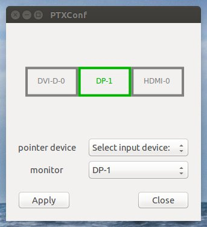

# PTXConf documentation

Pen tablet and Touch screen Xinput Configuration tool (PTXConf). 
Configures touch/pen devices to work with extended desktops and multiple screens on Linux.

## Usage
After starting the application a tablet pen icon sits in the system tray.


From the system tray icon you can access a configuration dialog



The dialog should show the configuration of your extended desktop as a set of monitors offset from each other.
Here you can select the input pen/touch device and associate it directly with a particular monitor.
To associate the input device and output monitor you must apply the setting using the Apply button.

## Installation
PTXConf depends on the python gtk2 and the AppIndicator binding. On debian based systems you can install these packages as follows,
```sh
$ sudo apt-get install python-gtk2
$ sudo apt-get install python-appindicator
```
Then install this package,
```sh
$ git clone http://github.com/wenhsinjen/ptxconf.git
$ cd ptxconf
$ sudo python setup.py install
```
After this package has been submitted to PyPI you will be able to do,
```sh
$ sudo pip install ptxconf
```

## API code examples

Some dummy code for testing MD...
```python
from ptxconftools import ConfController
cc = ConfController()
cc.listDevices()
```


